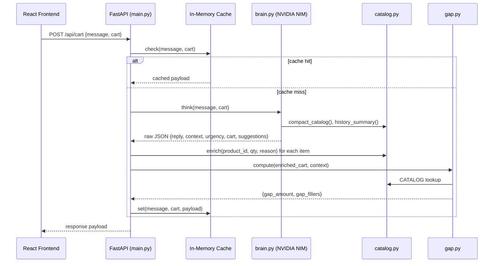
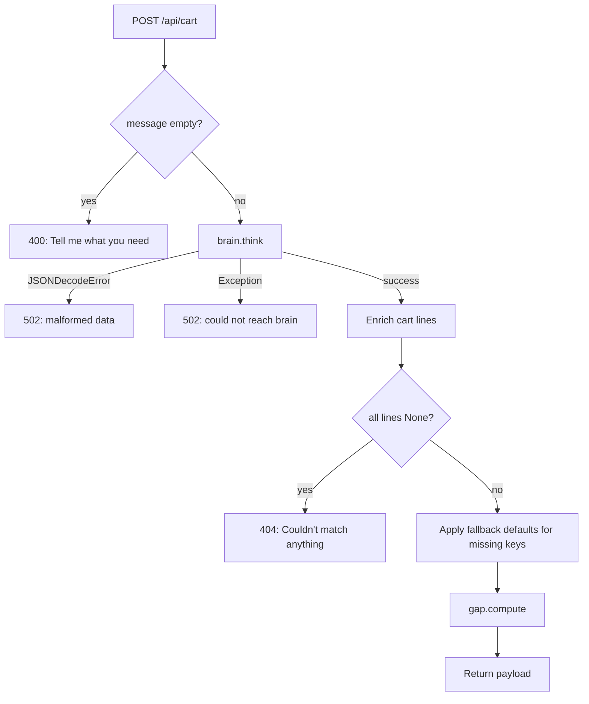

# Design Document: QCart AI Hardening

## Overview

This design hardens the QCart AI quick-commerce assistant for a reliable demo experience. The three workstreams are:

1. **Prompt hardening** — make `brain.py` produce deterministic context/urgency classification and obey refinement commands ("make it cheaper", "make it premium", "remove dairy", "for N people") reliably.
2. **Catalog expansion** — ensure `data/products.json` has sufficient premium and cheap variants to make tier-switching commands produce visible price/item changes.
3. **Gap engine tuning** — raise the free-delivery threshold so most first-turn carts trigger a nudge, and improve relevance scoring so fillers feel contextually appropriate.

All changes stay within the existing FastAPI + React architecture. No new services or databases are introduced. The primary risk mitigated is non-determinism from the LLM; we address this through stronger prompt engineering, structured fallback defaults, and rigorous validation in `main.py`.

## Architecture



The architecture remains unchanged. Hardening modifies internal behavior within existing modules:

| Module | Change Category |
|--------|----------------|
| `brain.py` | Prompt engineering: stronger instructions, explicit context/urgency rules, refinement command handling |
| `catalog.py` | No code changes (data-driven) |
| `data/products.json` | Add premium/cheap tagged variants to ensure tier-switching has targets |
| `gap.py` | Raise threshold (299–499), improve scoring with context-tag weights, add overshoot guard |
| `main.py` | Add fallback defaults for missing keys, validate JSON schema shape |

## Components and Interfaces

### brain.py — Prompt & LLM Interaction

**Responsibilities:**
- Construct the system prompt with catalog, history, and refined instructions
- Call NVIDIA NIM API and parse JSON response
- Handle markdown code-block stripping

**Interface (unchanged):**
```python
def think(message: str, cart: list) -> dict:
    """Returns parsed dict with keys: reply, context, urgency, cart, suggestions.
    Raises json.JSONDecodeError on malformed LLM output.
    Raises Exception on network/API errors."""
```

**Hardening changes:**
- Rewrite `INSTRUCTIONS` constant with explicit context-mapping rules (keyword → context) and urgency rules (context → urgency)
- Add refinement-specific prompt blocks: cheaper swaps `cheap`-tagged items, premium swaps `premium`-tagged items, remove dairy drops `dairy`-tagged items, for-N scales quantities
- Lower `temperature` to 0.2 for more deterministic output
- Add explicit "RESPOND WITH ONLY VALID JSON" guard rail repeated at end of prompt

### catalog.py — Data Layer

**Responsibilities:**
- Load and index `products.json`
- Provide lookup (`get`), enrichment (`enrich`), and prompt-formatting helpers

**Interface (unchanged):**
```python
def get(product_id: str) -> dict | None
def enrich(product_id: str, quantity: int, reason: str = "") -> dict | None
def compact_catalog() -> str
def history_summary() -> str
```

**Hardening changes:**
- None to code. Changes happen in `data/products.json` (more premium/cheap products).

### gap.py — Free Delivery Gap Engine

**Responsibilities:**
- Compute gap between cart subtotal and threshold
- Select top-3 context-relevant fillers that close the gap

**Interface (unchanged):**
```python
FREE_DELIVERY_THRESHOLD: int  # raised to 399
CONTEXT_TAGS: dict[str, list[str]]

def compute(cart: list, context: str = "routine") -> dict:
    """Returns {gap_amount: int, gap_fillers: list[dict]}"""
```

**Hardening changes:**
- Raise `FREE_DELIVERY_THRESHOLD` to 399 (within 299–499 range)
- Add `CONTEXT_TAGS` entries ensuring all six contexts are covered with ≥2 tags each
- Refine scoring: primary sort by tag-overlap count (descending), secondary by closeness to remaining gap (ascending abs-difference)
- Add overshoot guard: combined filler prices should not exceed gap + 60
- Add fallback: if context not in `CONTEXT_TAGS`, use `["snack", "staple"]` default

### main.py — API Layer & Validation

**Responsibilities:**
- Validate/enrich brain output against catalog
- Assemble response payload with gap info
- Return proper HTTP error codes

**Interface (unchanged):**
```python
POST /api/cart  -> CartTurnResponse
GET  /api/health -> HealthResponse
```

**Hardening changes:**
- Add fallback defaults when brain response is missing keys (reply, context, urgency, cart, suggestions)
- Keep existing validation: drop invalid product IDs silently, 404 when all items invalid, 502 on JSON parse error or unreachable brain

### data/products.json — Product Catalog Data

**Hardening changes:**
- Verify at least 5 products tagged "premium" across ≥3 categories (currently have 6 premium items across beverages and snacks — need at least one in another category like staples or produce)
- Verify at least 3 products tagged "cheap" across ≥2 categories (currently have 2 cheap items in beverages and snacks — need at least one more)
- Ensure premium items are ≥50% more expensive than their non-premium counterparts in the same category
- Ensure each premium item shares at least one tag with a non-premium item in the same category

## Data Models

### Brain Response Schema (LLM output)

```json
{
  "reply": "string — short friendly message",
  "context": "movie_night | party | health | baby | routine | late_night | other",
  "urgency": "high | normal",
  "cart": [
    {
      "product_id": "string — must exist in catalog",
      "quantity": "integer >= 1",
      "reason": "string — max 6 words"
    }
  ],
  "suggestions": [
    {
      "product_id": "string — must exist in catalog",
      "reason": "string — max 6 words"
    }
  ]
}
```

### Enriched Cart Line (after catalog.enrich)

```json
{
  "id": "string",
  "name": "string",
  "category": "string",
  "price": "number (₹)",
  "tags": ["string"],
  "quantity": "integer >= 1",
  "reason": "string",
  "line_total": "number (price * quantity)"
}
```

### Gap Engine Output

```json
{
  "gap_amount": "integer >= 0 (₹)",
  "gap_fillers": [
    {
      "id": "string",
      "name": "string",
      "price": "number (₹)",
      "reason": "string"
    }
  ]
}
```

### API Response Payload (POST /api/cart)

```json
{
  "reply": "string",
  "context": "string",
  "urgency": "string",
  "cart": ["Enriched Cart Line[]"],
  "suggestions": [{"id", "name", "price", "reason"}],
  "subtotal": "number",
  "free_delivery_threshold": "number",
  "gap_amount": "number",
  "gap_fillers": [{"id", "name", "price", "reason"}],
  "cached": "boolean"
}
```

### CONTEXT_TAGS Configuration (gap.py)

```python
CONTEXT_TAGS = {
    "movie_night": ["movie", "snack", "sweet"],
    "party":       ["party", "snack", "drink"],
    "health":      ["fever", "immunity", "comfort", "medicine"],
    "baby":        ["baby", "newparent"],
    "routine":     ["weekly", "staple", "breakfast"],
    "late_night":  ["snack", "instant", "drink"],
}
# Fallback when context not found: ["snack", "staple"]
```

## Correctness Properties

*A property is a characteristic or behavior that should hold true across all valid executions of a system — essentially, a formal statement about what the system should do. Properties serve as the bridge between human-readable specifications and machine-verifiable correctness guarantees.*

### Property 1: Invalid product IDs are dropped by enrichment

*For any* Brain response containing a mix of valid and invalid product IDs in the cart array, the enrichment pipeline SHALL produce an output containing only product IDs that exist in the Catalog, with all invalid IDs silently removed.

**Validates: Requirements 3.7, 12.2**

### Property 2: Premium price invariant

*For any* pair of products in the Catalog where one is tagged "premium" and the other is not, both share the same category, and both share at least one non-tier tag, the premium product's price SHALL be at least 50% higher than the non-premium product's price.

**Validates: Requirements 8.3**

### Property 3: Cheap price invariant

*For any* product in the Catalog tagged "cheap", there SHALL exist at least one product in the same category that is not tagged "cheap" and has a higher price.

**Validates: Requirements 8.5**

### Property 4: Premium tag overlap invariant

*For any* product in the Catalog tagged "premium", there SHALL exist at least one product in the same category that is not tagged "premium" and shares at least one non-tier tag (excluding "premium" and "cheap").

**Validates: Requirements 8.6**

### Property 5: Filler ordering correctness

*For any* cart with a non-zero gap and any valid context, the fillers returned by `gap.compute()` SHALL be ordered by descending relevance score (tag overlap with CONTEXT_TAGS[context]) as primary sort and ascending absolute difference between filler price and remaining gap as secondary sort, with at most 3 fillers returned.

**Validates: Requirements 10.2, 11.3**

### Property 6: Filler exclusion from cart

*For any* cart passed to `gap.compute()`, none of the returned filler product IDs SHALL appear in the input cart's set of product IDs.

**Validates: Requirements 10.3**

### Property 7: Filler fallback on unknown context

*For any* context string not present as a key in CONTEXT_TAGS, when passed to `gap.compute()` with a cart that has a non-zero gap and the catalog contains products within the overshoot guard, the engine SHALL still return fillers using the default tag set.

**Validates: Requirements 10.4**

### Property 8: Filler count bounds

*For any* cart where the subtotal is below FREE_DELIVERY_THRESHOLD and the catalog contains qualifying filler candidates, `gap.compute()` SHALL return between 1 and 3 fillers (inclusive).

**Validates: Requirements 11.1**

### Property 9: Filler overshoot guard

*For any* cart with a non-zero gap, the sum of all returned filler prices SHALL not cause the cart subtotal plus fillers total to exceed FREE_DELIVERY_THRESHOLD + 60.

**Validates: Requirements 11.2**

### Property 10: Fallback defaults on missing Brain keys

*For any* Brain response dict that is missing one or more of the required keys (reply, context, urgency, cart, suggestions), the backend fallback logic SHALL produce a complete response with all keys present, using defaults: reply → generic acknowledgement string, context → "routine", urgency → "normal", cart → empty array, suggestions → empty array.

**Validates: Requirements 12.1, 12.6**

## Error Handling

| Scenario | Module | Behavior |
|----------|--------|----------|
| Empty user message | `main.py` | HTTP 400 — "Tell me what you need." |
| Brain returns non-JSON | `main.py` | HTTP 502 — "Brain returned malformed data, try again." |
| Brain unreachable / API error | `main.py` | HTTP 502 — "Could not reach the brain: {error}" |
| All cart product IDs invalid | `main.py` | HTTP 404 — "Couldn't match anything. Try rephrasing." |
| Brain response missing keys | `main.py` | Apply fallback defaults silently, continue processing |
| Invalid product IDs in cart | `main.py` | Drop silently during enrichment; only valid lines proceed |
| Invalid product IDs in suggestions | `main.py` | Drop silently; only valid suggestions included |
| Gap = 0 (cart meets threshold) | `gap.py` | Return `{gap_amount: 0, gap_fillers: []}` |
| No qualifying fillers | `gap.py` | Return `{gap_amount: N, gap_fillers: []}` |
| Unknown context in gap engine | `gap.py` | Fall back to `["snack", "staple"]` tag set |

### Error Propagation Flow



## Testing Strategy

### Approach

Testing for this hardening effort splits into two tiers:

1. **Property-based tests** — validate universal invariants of the gap engine, catalog data, enrichment pipeline, and fallback logic. These are pure functions with clear inputs/outputs where running 100+ iterations with random inputs catches edge cases.
2. **Integration tests** — validate LLM prompt behavior across the six demo scenarios and four refinement commands. These require calling the actual NVIDIA NIM API (or recorded responses) and verifying output structure and content.

### Property-Based Testing

**Library:** [Hypothesis](https://hypothesis.readthedocs.io/) (Python)

**Configuration:**
- Minimum 100 iterations per property test (`@settings(max_examples=100)`)
- Each test tagged with: `# Feature: qcart-hardening, Property {N}: {title}`

**Properties to implement:**

| # | Property | Module Under Test |
|---|----------|-------------------|
| 1 | Invalid IDs dropped by enrichment | `catalog.enrich` via `main.py` pipeline |
| 2 | Premium price invariant | `data/products.json` (loaded by `catalog.py`) |
| 3 | Cheap price invariant | `data/products.json` |
| 4 | Premium tag overlap invariant | `data/products.json` |
| 5 | Filler ordering correctness | `gap.compute()` |
| 6 | Filler exclusion from cart | `gap.compute()` |
| 7 | Filler fallback on unknown context | `gap.compute()` |
| 8 | Filler count bounds | `gap.compute()` |
| 9 | Filler overshoot guard | `gap.compute()` |
| 10 | Fallback defaults on missing keys | `main.py` validation logic |

**Generators needed:**
- Random cart lines (subset of valid catalog products with random quantities 1–10)
- Random context strings (both valid contexts and arbitrary strings for fallback testing)
- Random Brain response dicts (valid keys/values + missing keys + invalid product IDs)

### Integration Tests

**Scope:** Test actual LLM responses for the six scenarios (movie_night, party, health, baby, routine, late_night) and four refinement commands (make it cheaper, make it premium, remove dairy, for N people).

**Approach:**
- Record golden responses from the LLM during development
- Replay against assertions: correct context, correct urgency, valid product IDs, expected tag coverage
- Run against live API during CI (optional, slower)

### Smoke Tests

**Scope:** Catalog data validations that are one-time checks:
- ≥5 premium products
- Premium products span ≥3 categories
- ≥3 cheap products spanning ≥2 categories
- CONTEXT_TAGS has all 6 contexts with ≥2 tags each
- FREE_DELIVERY_THRESHOLD is between 299 and 499

### Unit Tests (Example-Based)

**Scope:** Specific error-handling paths:
- Brain returns non-JSON → 502
- Brain unreachable → 502
- All IDs invalid → 404
- Empty message → 400
- Typical 2-3 item carts fall below threshold (Requirement 9.3)
- Representative scenario carts produce non-zero gaps for ≥3/5 scenarios (Requirement 9.2)

### Test File Organization

```
backend/
  tests/
    test_gap_properties.py      # Property tests for gap engine (Properties 5–9)
    test_catalog_properties.py  # Property tests for catalog invariants (Properties 2–4)
    test_validation_properties.py  # Property tests for enrichment + fallback (Properties 1, 10)
    test_integration_scenarios.py  # Integration tests for LLM scenarios
    test_smoke_catalog.py       # Smoke tests for catalog constraints
    test_error_handling.py      # Unit tests for error paths
```

